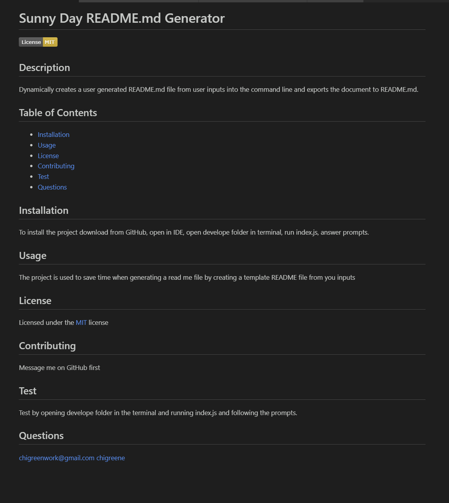

# Dynamic README.md Generator

## Description
Dynamically creates a user generated README.md file from user inputs into the command line and exports the document to README.md.

- My motivation to write this project was to simplify the process of making a README file and to practice using node js. 
- I built this project because I write many README files and wanted save time producing them and to make sure I produce the best README files possible. I also needed a practical problem to solve with node.js and this project was a good place to start. 
- This problem solves the problem of having to constantly re-look up how to write a professional README file every time I need to write one.
- I learned how to use use inquired to take user inputted information and write it to a file. I also learned how to write files using node.js. 

Screenshot of the a user generated README file created using the application. 

## Usage

1. Download file from [GitHub](https://github.com/chigreene/Dynamic-README-Generator)
2. Open in you IDE
3. Open develope folder in terminal
4. Run index.js
5. Answer prompts
6. File is written to the generateFile folder

Need more help? Please watch this [video](https://drive.google.com/file/d/12SvdwUnUnXnrOLexM6f5GDKvyu4tEVFT/view)

## Credits

EdX, [Assistian](https://youtu.be/9ZHzhHiBwqc?si=8P-pU13g2s4aqJN4), MDN

